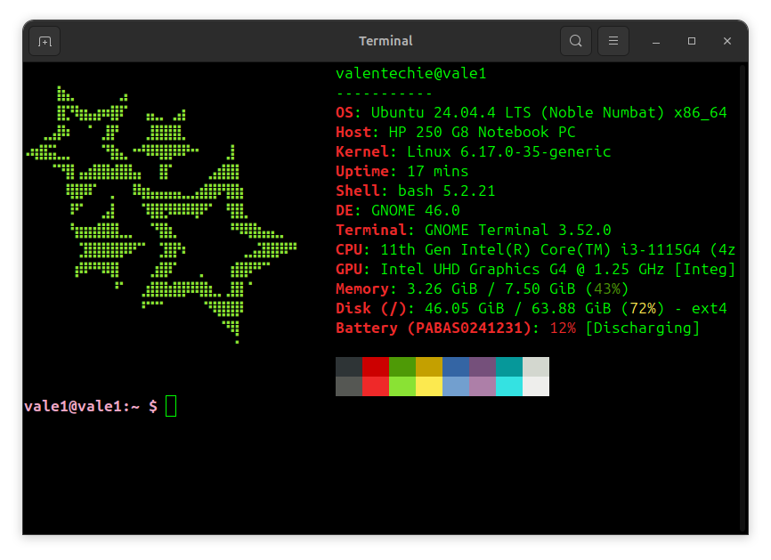

-E95420)

## Preview


## Fastfetch Setup

```bash
#-------------------------------
# 1. Install Fastfetch
curl -LO https://github.com/fastfetch-cli/fastfetch/releases/latest/download/fastfetch-linux-amd64.deb
sudo apt install ./fastfetch-linux-amd64.deb

#-------------------------------
# 2. Clone this repository
git clone https://github.com/valentechie/dotfiles.git ~/dotfiles

#-------------------------------
# 3. Copy the config files
# (this overwrites your current Fastfetch config)
mkdir -p ~/.config/fastfetch
cp ~/dotfiles/fastfetch/config.jsonc ~/dotfiles/fastfetch/ascii.txt ~/.config/fastfetch/

#-------------------------------
# 4. Run Fastfetch on terminal startup
echo 'fastfetch' >> ~/.bashrc

#-------------------------------
# 5. Reload terminal
source ~/.bashrc
```

## Customization

```bash
#-------------------------------
# Edit modules, layout and colors
code ~/.config/fastfetch/config.jsonc
# If you don't use VS Code, open with:
nano ~/.config/fastfetch/config.jsonc

#-------------------------------
# Change the logo
# Replace ~/.config/fastfetch/ascii.txt with your own ASCII art
```
